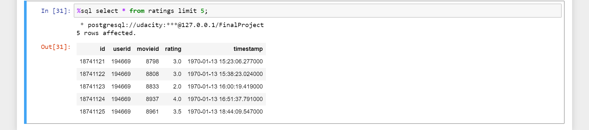
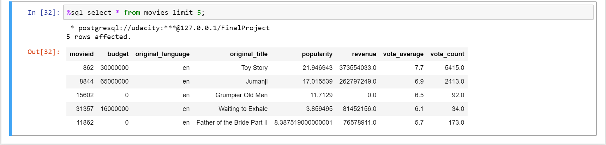
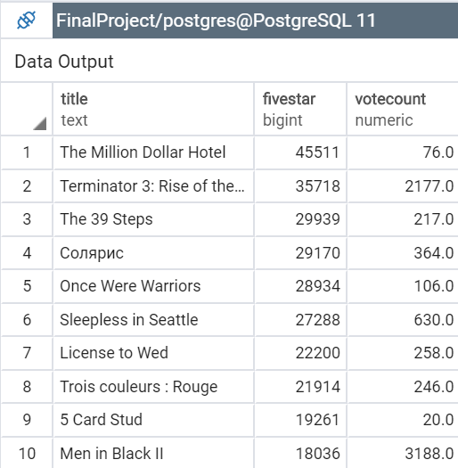

## Movies DB and ETL
A Movie Analytics company has a requirement to analyze movies for generating reports for their Business Analysts in their team. There are  2 raw files which periodically arrive every month a fixed location in CSV format. These files need to be cleansed and finally stored in a Postgres Database which is then read by the BA team members. 

An ETL job has thus been created to read these CSV files each time the job is run and the data is appended to the Postgres DB at the end of the process to meet their requirement.

### Dataset:
#### Movies Dataset
The Movies dataset is a subset of real data from the [Kaggle Movies Dataset](https://www.kaggle.com/rounakbanik/the-movies-dataset). The main Movies Metadata file. Contains information on 45,000 movies featured in the Full MovieLens dataset. Features include posters, backdrops, budget, revenue, release dates, languages, production countries and companies.

#### Ratings Dataset
The Ratings Dataset consists of ratings information from the [Kaggle Movies Dataset](https://www.kaggle.com/rounakbanik/the-movies-dataset). The ratings consists of ratings of 26 Million ratings by different users for all the movies listed in the movies dataset.

### Data Model:

The Data Model consists of two tables which are the Ratings Table and the Movies Table. The Ratings Table is the main Fact Table which houes the ratings of the users and an associated reference to the movie. The Movies Table is the information table which houses the specific information about the individual movies themseleves. A description of the two tables are below. 

#### Movies Table
The Movies Table consists of attributes applicable to the individual Movies. The individual consists of the *movieid* as the Primary Key, *budget, original_language, original_title, popularity, revenue, vote_average* and *vote_count*. The movieid and the budget are set as BIGINT since they are expected to store values in excess of 100 Million. The original_language and original_text are set to varchar and text respectively. The other columns are set to numeric since they will hold fractional values. 

#### Ratings Table
The Ratings Table consists of the *userId , movieId, rating* and *timestamp*. The userId and movieId are set to BIGINT since they are expected to be large integer values whereas the rating is set as a real number and the timestamp is a TIMESTAMP value to store when the movie was rated.

 
### ETL Approach
The ETL job is expected to get a batch of 2 raw CSV files consisting of the ratings and movies data. The CSV data is read in a pandas data frame. It is first cleansed removing any duplicated ratings for a given movie along with removing any rows with null columns. The timestamp column is then converted to a timestamp format to match the DB column along with matched column names and is then written to the Ratings Postgres Table.

Subsequently the movies CSV file is processed. First columns which have more than 0.1% as nulls are dropped.Also are dropped the columns which are not required for analysis. The idea is to not have any null values and hence default values are stored where there are expected to be nulls. The individual column attributes are modified to match the column attributes in the DB Table. Then the data is chunked and written to the Postgres Movies Table.

### Justification of Tools and Technologies
Since the analytics are expected to be undertaken by Business Analysts who would prefer to connect their Business Intelligence Tools to a relational DB and run SQL queries, Postgres has been chosen as the DB of choice since it is a widely used relational Database in the industry. Additionally, it is also available on various Cloud Platforms. Jupyter Notebook has been selected for data exploration since it is also an industry standard for exploration and is capable of connecting to different data sources and data sets over a simple UI.The ratings information has the summarized information and presents itself as a natural choice for the fact table and a similar thought process was applicable for the movies data as well.

### Files
There are 3 python files applicable to this project. The *sql_queries.py* file has all the queries to create, insert and drop the DB tables. The *create_tables.py* module consists of the scripts to drop and recreate all the tables. The *etl.py* is the file that undertakes the ETL job of reading the data files and running the ETL job to store the data into the appropriate tables. There is also a python notebook *MoviesUdacityDENDFinalProject.ipynb* which shows the data exploration steps which formed the basis of the ETL job.

### Scripts
To run the scripts, please ensure that there is an existing connection to a Postgres DB with 'udacity' and 'udacity' as the username and password. Then run the create_tables.py script first to drop existing tables and create new ones. Subsequently run the etl.py script to load the the data into the tables in the database.

### Final Tables Structure
A Sample snapshot of the final table structures are as below:

    The Ratings Table

    The Movies Table
   

 

### Sample Analytics Query/Response
Give me the names of all the movies over all time which have received a Five Star Rating and their Vote Count

**Query**
*SELECT m.original_title as Title ,count(r.movieid) as FiveStar,vote_count as VoteCount from movies m
INNER JOIN ratings r
ON r.movieid = m.movieid
WHERE r.rating = 5
GROUP BY title, VoteCount 
ORDER BY fiveStar DESC LIMIT 10;*

**Response**:

### Addressing Other Scenarios

It is expected that the Database would be hosted in a Cloud Platform to ensure maximum elasticity and availability. AWS RDS platform is once such example where the DB could be hosted. If the Data increases by 100x, the Virtual Machine hosting the DB could be increased for additional Disk Space or RAM. The ETL job can easily be run using an AWS scheduled Lambda function reading from an S3 bucket at 7 AM every day and writing to an RDS Postgres DB. If there are 100+ people reading, a Read Replica of the RDS instance could be created exclusively dedicated to analytics.